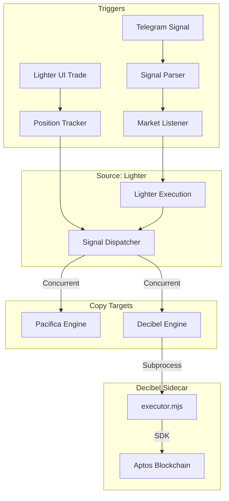

# Lighter Copy Trading Bot Documentation

## Overview
This bot is a high-performance, real-time trading engine designed to synchronize positions from the **Lighter** exchange (Orderbook DEX) to **Pacifica** and **Decibel** (Perpetual DEXes). It operates in two primary modes:
1.  **Signal Mode**: Monitors Bybit SPOT 5-minute candle closes based on Telegram-input signals.
2.  **UI Sync Mode**: Monitors the Lighter UI in real-time via WebSocket. Any trade placed manually on Lighter is instantly detected and mirrored to Pacifica and Decibel.

## Architecture

### 1. Signal Detection & Parsing
*   **Source**: Bybit SPOT WebSocket (`wss://stream.bybit.com/v5/public/spot`).
*   **Logic**: Signals are parsed from Telegram (e.g., `BTC > 70000 LONG TP: 500p SL: 250p`). The bot waits for a **confirmed 5-minute candle close** on Bybit that meets the condition.
*   **Slippage Protection**: If the candle close price is too far from the trigger price (defined by `MAX_TRIGGER_SLIPPAGE`), the signal is invalidated to prevent "trap" entries.

### 2. Lighter UI Tracking
*   **Source**: Lighter Account WebSocket.
*   **Logic**: The `PositionTracker` listens for `account_all_positions` updates.
*   **TP/SL Discovery**: When a new position (or increase) is detected, the bot queries Lighter's active orders for that market to discover the **Take Profit** and **Stop Loss** distances in pips.
*   **Infinite Loop Prevention**: Bot-executed trades are marked and ignored by the tracker to prevent them from being "re-copied" back into the system.

### 3. Copy Engine Dispatch
*   **Concurrency**: Uses `asyncio.gather` to dispatch signals to all enabled target exchanges simultaneously.
*   **Zero-Default Policy**: No hardcoded default TP/SL pips are used. Signals only carry TP/SL if they were explicitly provided in the signal text or discovered on the Lighter UI.

### 4. Target Execution (Pacifica & Decibel)
*   **Risk-Based Sizing**: Position size is calculated using the formula:
    `Position Size = MAX_LOSS_USD / SL_PIPS`
    This ensures that regardless of the entry price or leverage, the maximum loss if the SL is hit remains constant (e.g., ~$20).
*   **Leverage**: Each exchange has its own leverage setting (e.g., 40x).
*   **TP/SL Application**: TP/SL are applied as **absolute prices** relative to the target exchange's fill price, ensuring the pip distance from Lighter is preserved.

## Data Flow Diagram

## Configuration ( .env )

### Lighter
*   `LIGHTER_PRIVATE_KEY`: Your Lighter signing key.
*   `LIGHTER_ACCOUNT_INDEX`: Your integer account ID (e.g., `722983`).

### Pacifica
*   `PACIFICA_API_KEY`: Your Pacifica API Agent Key.
*   `PACIFICA_SUBACCOUNT`: (Optional) Your Pacifica subaccount address. Leave blank for main account.

### Decibel
*   `DECIBEL_PRIVATE_KEY`: Your API Wallet private key (AIP-80 format supported).
*   `DECIBEL_NODE_API_KEY`: Your Decibel Node API Key (Bearer Token).
*   `DECIBEL_SUBACCOUNT`: **Mandatory** Trading Account address.

## Security Features
1.  **Authorized Users**: Only Telegram IDs listed in `ALLOWED_TELEGRAM_USER_IDS` can control the bot.
2.  **Isolated Margin**: All Lighter trades are executed in Isolated Margin mode with explicitly set leverage.
3.  **Error Handling**: Sidecar failures or API rejections are logged and notified via Telegram without crashing the main engine.
